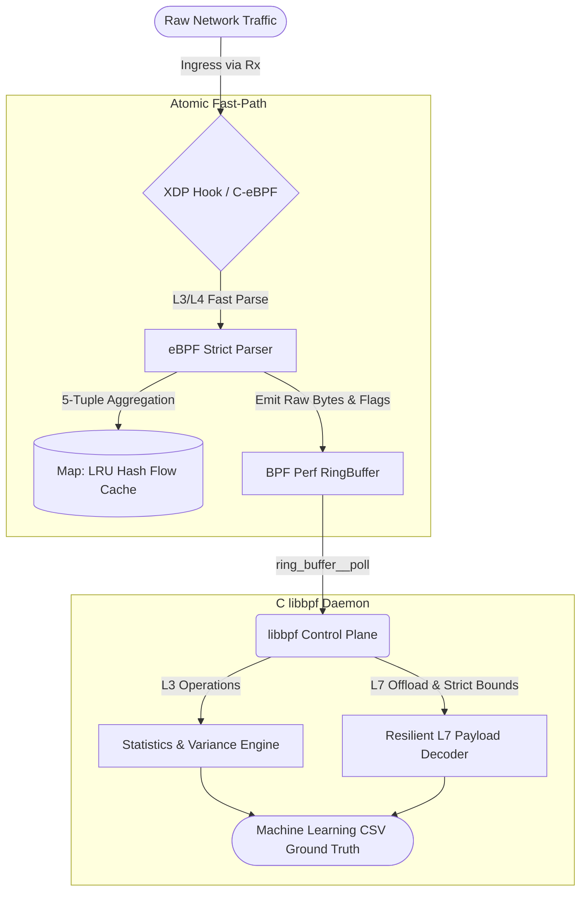

    <h1>🛡️ eBPFNetFlowLyzer</h1>
    <i>High-Performance, Stateful, Hybrid L3/L4/L7 Network Feature Extractor Powered by 100% End-to-End eBPF and C.</i>

 

## 📌 Overview

**eBPFNetFlowLyzer** is a high-performance network traffic feature extractor built to overcome the systematic bottlenecks and measurement biases present in traditional IDS (Intrusion Detection System) dataset generators. 

It fuses the comprehensive statistical power of legacy L3/L4 extractors (like *NTLFlowLyzer*) and L7 application decoders (like *ALFlowLyzer*) into a single, wire-speed, memory-efficient pipeline. By leveraging an **End-to-End C architecture** powered by **eBPF/XDP (Extended Berkeley Packet Filter)** in the Linux Kernel paired with a deeply optimized **libbpf** user-space daemon, eBPFNetFlowLyzer generates over 350+ machine-learning-ready features without packet loss, even under extreme volumetric DDoS attacks (e.g., TCP SYN floods).

## 🎯 The Problem It Solves

Legacy flow extractors typically rely on user-space libraries (like `libpcap`) and slow dictionary-based state tracking or high-level scripting (e.g., `scapy` in Python). Under high-stress network environments, this architecture causes severe bottlenecks:
1. **Aggregation Collapse**: Exhausted state-tables cause the system to artificially drop connection tracking, resulting in massive loss of flow granularity.
2. **Data Leakage & F1 Blindness**: Unclosed timeouts and chaotic buffer overflows cause legacy extractors to generate biased or invalid features (e.g., attributing TCP FIN flags to UDP volumetric floods). This inadvertently creates synthetic "noise" that Machine Learning classification models exploit, providing unrealistic evaluation scores (F1-Blindness) rather than learning the actual attack patterns.

**eBPFNetFlowLyzer** eliminates these flaws by discarding packets in the kernel and managing connection states through lock-free mechanisms, establishing a reliable ground-truth for cybersecurity research and real-time defense.

---

## 🏛️ Architecture Blueprint

The project heavily adopts a split-architecture paradigm, ensuring strict boundaries between what gets processed in the fast-path (Kernel) versus the slow-path (User-Space), maintaining absolute C-native pointer efficiency globally.

### 1. Data Plane (Kernel-Space / eBPF XDP)
Intercepts packets natively at the Network Interface Card (NIC) driver level:
* **Passive State Management:** Replaces slow software loops with hardware-efficient `BPF_MAP_TYPE_LRU_HASH`. Dead or stale connections are automatically pruned by the kernel.
* **Surgical Parsing:** Instantly unpacks Ethernet/IP headers and extracts strict L3/L4 properties (flags, raw byte limits, timestamps).
* **Zero-Copy Pipeline:** The metadata and narrowed L7 payloads (such as port 53 DNS records) are pushed seamlessly to user space through an asynchronous `BPF_MAP_TYPE_RINGBUF`.

### 2. Control Plane (User-Space / C libbpf Daemon)
Receives the raw telemetry and performs resource-heavy statistical computations directly in C, maximizing hardware throughput and ensuring strictly vetted memory safety:
* **Welford's Online Algorithm:** Computes complex math like Forward/Backward Packet Variances iteratively without allocating volatile arrays in memory.
* **Resilient L7 Decapsulation:** In-house pointer bound-checking mechanisms (`(void *)data + offset > data_end`) prevent arbitrary memory exploitation or Segfaults from malformed attacker payloads during DNS string extractions.
* **Dataset Export:** Lock-free CSV buffering to ensure disk I/O does not bottleneck the `ring_buffer__poll` events.

### Flow Diagram

---

## 🛠️ Toolchain & Requirements

*   **Core Systems:** ANSI C (End-to-End approach).
*   **eBPF Loader API:** Utilizes standard `libbpf` for CO-RE (Compile Once - Run Everywhere) portability without needing target-environment kernel headers.
*   **Build Environment:** Requires `clang`, `llvm`, `make`, `libelf-dev`, and `bpftool`. 

   
  <i>Empowering next-generation network telemetry and autonomous defense systems.</i>

