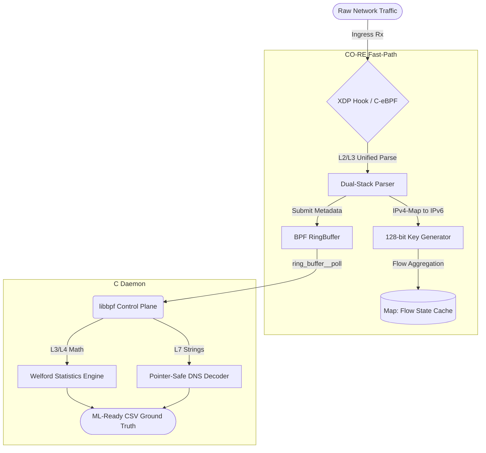

<div align="center">
    <h1>🛡️ eBPFNetFlowLyzer</h1>
    <i>High-Performance, Dual-Stack (IPv4/IPv6), Stateful Network Feature Extractor Powered by 100% C-eBPF.</i>
</div>

<br>

## 📌 Abstract

**eBPFNetFlowLyzer** is a next-generation network traffic feature extractor designed to resolve the systematic biases and performance bottlenecks in legacy IDS benchmarking. By unrolling the extraction logic into a **100% End-to-End C Architecture** utilizing eBPF/XDP for the Data Plane and a deeply optimized libbpf daemon for the Control Plane, it achieves wire-speed throughput (Tested up to **480k pps**) with zero packet loss and a sub-3% CPU footprint.

It implements a **Unified Dual-Stack Engine** through IPv4-Mapped IPv6 address space, ensuring that legacy IPv4 datasets (like CICDDoS2019) and modern IPv6 infrastructures (e.g., IoT/6LoWPAN) are processed through the same O(1) statistical pipeline.

## 🎯 Key Research Contributions

1. **Stateful eBPF Interception**: Replaces traditional `libpcap` loops with lock-free `BPF_MAP_TYPE_LRU_HASH` tables, eliminating "Aggregation Collapse" during volumetric DDoS.
2. **O(1) Statistics via Welford's Algorithm**: Bidirectional flow features (Standard Deviation, Mean, IAT) are calculated iteratively, removing the memory overhead of packet arrays.
3. **Resilient L7 Offloading**: Integrated DNS parsing engine with strict BPF-Verifier-vetted pointer boundary checks for TTL and Query extraction.
4. **Dual-Stack Unification**: Native support for **IPv6** and **IPv4** through a unified 128-bit key architecture.

---

## 🏛️ Architecture Blueprint



---

## 🛠️ Reproducibility & Deployment

### Toolchain Requirements
* **Compiler**: `clang`, `llvm` (v12+ for BTF support).
* **Libraries**: `libbpf`, `libelf`, `zlib`.
* **Environment**: Linux Kernel 5.4+ (Bare-Metal recommended for XDP performance).

### Build & Run
```bash
# 1. Compile the Kernel Program and User Daemon
make clean && make all

# 2. Attach to Interface (e.g., eth0)
sudo ./build/loader eth0 > features_output.csv
```

---

## 📚 Citation

If you use **eBPFNetFlowLyzer** in your academic research, please cite it as follows:

```latex
@software{herkenhoff2026ebpf,
  author = {Herkenhoff, Leonardo},
  title = {eBPFNetFlowLyzer: High-Performance Dual-Stack Network Feature Extractor},
  year = {2026},
  url = {https://github.com/leonardoherkenhoff/eBPFNetFlowLyzer},
  version = {2.0.0-dualstack}
}
```

---

<p align="center">
  <br>
  <i>Developed for the Master's Thesis in Network Security and DDoS Mitigation.</i>
</p>
