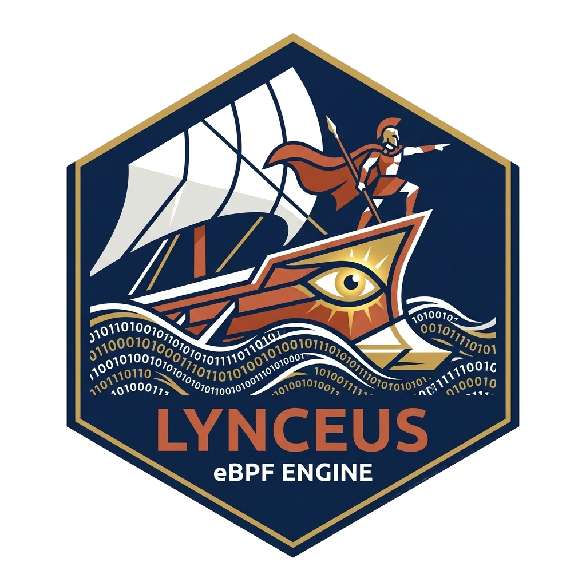

<p align="center">
  
</p>

# 🛡️ Lynceus v2.0

**Massively Parallel eBPF Flow Extraction Engine.**

---

## 📌 Overview

**Lynceus** is a state-of-the-art network telemetry engine designed for high-resolution flow extraction in dynamic N-Core environments. Leveraging eBPF/XDP and a **Massively Parallel Shared-Nothing Architecture**, it provides the high-fidelity data required for autonomous network systems and advanced security research (MAPE-K loops).

The name is derived from **Lynceus**, the Argonaut possessing legendary vision capable of seeing through any physical barrier. This reflects the project's core mission: providing deep, "X-ray" introspection into kernel-space network flows with absolute integrity.

---

## 🚀 Key Features

*   **Elastic N-Core Scalability**: Automatically detects host topology and instantiates a dynamic **Map-in-Map** structure for lockless, core-private ingestion.
*   **Zero-Contention Partitioned I/O**: Decentralized multi-threaded persistence where each CPU core writes to its own isolated stream, bypassing global filesystem locks.
*   **High-Fidelity Statistical Suite**: Numerically stable $O(1)$ calculation of 4th-order moments (Mean, Variance, Skewness, Kurtosis) using Welford's Algorithm.
*   **NUMA-Aware Performance**: Real-time CPU affinity pinning to maximize cache locality and minimize cross-socket latency on modern multi-socket hardware.
*   **Protocol-Agnostic Introspection**: Full support for IPv4/IPv6 and multi-layer VLAN encapsulation without performance degradation.

---

## 🏛️ System Architecture

### 1. Data Plane (Kernel Space)
XDP-based interceptor implementing atomic 5-tuple normalization and bidirectional flow correlation. Telemetry is routed via SMP-Processor ID to core-specific RingBuffers.

### 2. Control Plane (User Space)
A decentralized C-Daemon utilizing **Shared-Nothing Workers**. Each worker manages its own flow tables and statistical accumulators, persisting data via high-velocity Partitioned I/O.

---

## 🎓 Etymology & Concept

The name is inspired by **Lynceus**, the Argonaut possessing legendary vision. In Greek mythology, Lynceus was capable of seeing through any physical barrier—be it earth, stone, or deep water. This serves as the perfect metaphor for this engine's mission: utilizing eBPF/XDP to provide deep, "X-ray" introspection into kernel-space network flows, exposing features that are invisible to traditional observation methods.

---

## 🛠️ Build & Usage

### Prerequisites
- Linux Kernel 5.15+
- `clang`, `llvm`, `libbpf`

### Compilation
```bash
make clean && make all
```

### Execution
```bash
sudo ./build/loader <interface_name>
```

---

## ⚖️ License & Credits

Distributed under the **GNU General Public License v2.0**.
Designed for the **SBSeg 2026** Research Report and Master's Dissertation in Applied Computing.

---
**Lynceus: Precise Vision, Absolute Integrity.**
